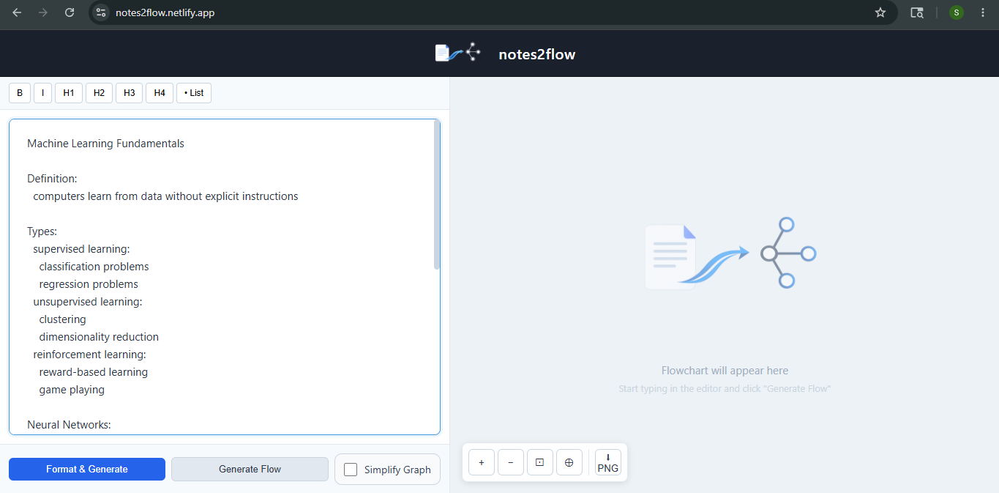
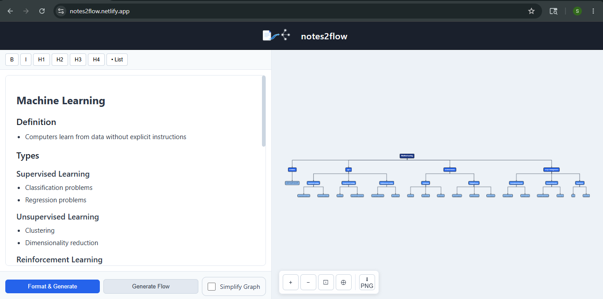

  <a href="https://notes2flow.netlify.app">
    <picture>
      <source srcset="assets/logo_light.png" media="(prefers-color-scheme: dark)">
      
    </picture>
  </a>

<h1 align="center">notes2flow</h1>

  Convert messy notes into structured flowcharts instantly.

  <a href="https://notes2flow.netlify.app"><b>Live Demo</b></a> •
  <a href="#quick-start-no-setup">Quick Start</a> •
  <a href="#how-it-works">How It Works</a>

## The Problem

You write fast, but your notes are chaos:
- Bullet points buried under paragraphs
- Hierarchy unclear
- Relationships between ideas invisible
- Manual flowchart tools kill your creative flow

**Result:** You lose the structure in your own thinking.

## The Solution

Paste any notes. AI parses the structure. Flowchart generates in seconds.

No dragging. No manual layout. No learning curve.

## Features

- Smart structure extraction  
- Instant flowchart generation  
- Editable nodes in-browser  
- Graph simplification   
- Export as PNG  
- Works with any note format (bullets, paragraphs, markdown)

### Input → Output

  
  

## How It Works

1. **Paste** — Any format. Bullets, paragraphs, markdown, whatever.
2. **AI Parses** — Identifies topics, subtopics, and relationships.
3. **Flowchart Generates** — Real-time visualization of your structure.
4. **Export** — Download as PNG or edit nodes in-browser.

## Try It Now

**Live Demo:** [notes2flow.netlify.app](https://notes2flow.netlify.app)

No signup. Just paste and generate.

## Quick Start (No Setup)

1. Go to [notes2flow.netlify.app](https://notes2flow.netlify.app)
2. Paste your notes into the editor
3. Click **"Format & Generate"** — AI parses messy text and structures it into organized HTML
4. Click **"Generate Flow"** — Converts structured HTML into visual flowchart
5. (Optional) Click **"Simplify Graph"** — Removes redundant nodes, cleans up hierarchy
6. Download as PNG or edit nodes directly in-browser

### What Each Button Does

**Format & Generate**
- Parses your messy notes (bullets, paragraphs, any format)
- Identifies topics, subtopics, and relationships
- Outputs structured HTML with clear hierarchy
- Takes 2-3 seconds

**Generate Flow**
- Converts structured HTML into visual flowchart
- Creates nodes and edges based on relationships
- Renders interactive graph in real-time
- Takes 1-2 seconds

**Simplify Graph**
- Removes duplicate or redundant nodes
- Collapses overly complex branches
- Improves visual clarity and readability
- Click multiple times to iterate and refine

## Built With

- **Backend:** Python + FastAPI
- **Visualization:** Cytoscape.js
- **AI Parsing:** Groq API 

## Contributing

Have an idea or found a bug? Open an issue or PR on [GitHub](https://github.com/yourusername/notes2flow).

## Connect

[LinkedIn](https://www.linkedin.com/in/shubhankarbhide/) | [GitHub](https://github.com/04Shubhankar) 
